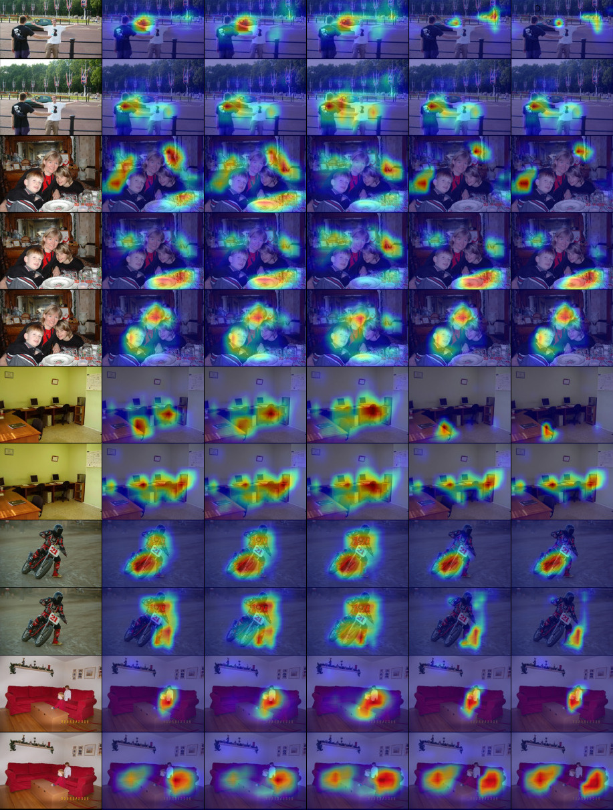

# MinMax-CAM

Official implementation for the paper "MinMax-CAM: Improving Focus of CAM-Based Visualization Techniques in Multi-Label Problems",
presented at 17th International Joint Conference on Computer Vision, Imaging and Computer Graphics Theory and Applications (VISAPP 2022).

Implementations:

- [MinMax-CAM](src/minmax.py#L21)
- [D-MinMax-CAM](src/minmax.py#L52)
- [MinMax-Grad-CAM](src/minmax.py#L89)
- [D-MinMax-Grad-CAM](src/minmax.py#L122)
- [Kernel Usage Regularization](src/kur.py)

## Examples
The figure below illustrates the explaining regions proposed by multiple visual explaining techniques,
for each one of the classified labels in each image.
The techniques are, from left to right, CAM, Grad-CAM++, Score-CAM, MinMax-CAM and D-MinMax-CAM.



## Summary

We list below the notebooks used to train, evaluate and observe the multiple CAM-based visualization methods studied in our work.

#### Training

| #   | Dataset   | Name | Description |
| --- | --------- | ---- | ----------- |
| 1   | VOC 2007  | [resnet101-multilabel-pascal-voc-2007](notebooks/experiments/1-training/resnet101-multilabel-pascal-voc-2007.ipynb) | training notebook for a ResNet101 multi-label classifier over the Pascal VOC 2007 dataset |
| 2   | VOC 2007  | [vgg16-multilabel-pascal-voc-2007](notebooks/experiments/1-training/vgg16-multilabel-pascal-voc-2007.ipynb) | training notebook for a VGG16-GAP multi-label classifier over the Pascal VOC 2007 dataset |
| 3   | VOC 2007  | [efficientnetb6-multilabel-pascal-voc-2007](notebooks/experiments/1-training/efficientnetb6-multilabel-pascal-voc-2007.ipynb) | training notebook for a EfficientNet-B6 multi-label classifier over the Pascal VOC 2007 dataset |
| 4   | VOC 2012  | [resnet101-multilabel-pascal-voc-2012](notebooks/experiments/1-training/resnet101-multilabel-pascal-voc-2012.ipynb) | training notebook for a ResNet101 multi-label classifier over the Pascal VOC 2012 dataset |
| 5   | COCO 2017 | [resnet101-multilabel-pascal-coco](notebooks/experiments/1-training/resnet101-multilabel-pascal-coco.ipynb) | training notebook for a ResNet101 multi-label classifier over the COCO 2017 dataset |
| 6   | P:AfS     | [resnet101-multilabel-amazon-from-space](notebooks/experiments/1-training/resnet101-multilabel-amazon-from-space.ipynb) | training notebook for a ResNet101 multi-label classifier over the Planet: Understanding the Amazon from Space dataset |

#### Evaluation

| #   | Dataset    | Name | Description |
| --- | ---------- | ---- | ----------- |
| 1   | VOC 2007   | [cam-benchmarks-voc-2007](notebooks/experiments/2-benchmarks/cam-benchmarks-voc-2007.ipynb) | evaluation notebook for multiple explaining methods, using the VGG16-GAP, ResNet101 and EfficientNet-B6 networks over the Pascal VOC 2007 dataset |
| 2   | VOC 2012   | [cam-benchmarks-voc-2012](notebooks/experiments/2-benchmarks/cam-benchmarks-voc-2012.ipynb) | evaluation notebook for multiple explaining methods, using the ResNet101 network over the Pascal VOC 2012 dataset |
| 3   | COCO 2017  | [cam-benchmarks-coco](notebooks/experiments/2-benchmarks/cam-benchmarks-coco.ipynb)         | evaluation notebook for multiple explaining methods, using the ResNet101 network over the COCO 2017 dataset |
| 4   | P:AfS      | [cam-benchmarks-amazon-from-space](notebooks/experiments/2-benchmarks/cam-benchmarks-amazon-from-space.ipynb) | evaluation notebook for multiple explaining methods, using the ResNet101 network over the Planet: Understanding the Amazon from Space dataset |

#### Analysis

| #   | Dataset    | Name | Description |
| --- | ---------- | ---- | ----------- |
| 1   | VOC 2007   | [study-of-sigmoid-multilabel-voc-2007](notebooks/experiments/3-analysis/study-of-sigmoid-multilabel-voc-2007.ipynb) | analysis notebook for multiple explaining methods, using the ResNet101 network over the Pascal VOC 2007 dataset |
| 2   | VOC 2012   | [study-of-sigmoid-multilabel-voc-2012](notebooks/experiments/3-analysis/study-of-sigmoid-multilabel-voc-2012.ipynb) | analysis notebook for multiple explaining methods, using the ResNet101 network over the Pascal VOC 2012 dataset |
| 3   | P:AfS      | [study-of-sigmoid-multilabel-amazon-from-space](notebooks/experiments/3-analysis/study-of-sigmoid-multilabel-amazon-from-space.ipynb) | analysis notebook for multiple explaining methods, using the ResNet101 network over the Planet: Understanding the Amazon from Space dataset |

## Citation

```
@conference{visapp22,
author={Lucas David. and Helio Pedrini. and Zanoni Dias.},
title={MinMax-CAM: Improving Focus of CAM-based Visualization Techniques in Multi-label Problems},
booktitle={Proceedings of the 17th International Joint Conference on Computer Vision, Imaging and Computer Graphics Theory and Applications - Volume 4: VISAPP,},
year={2022},
pages={106-117},
publisher={SciTePress},
organization={INSTICC},
doi={10.5220/0010807800003124},
isbn={978-989-758-555-5},
}
```
